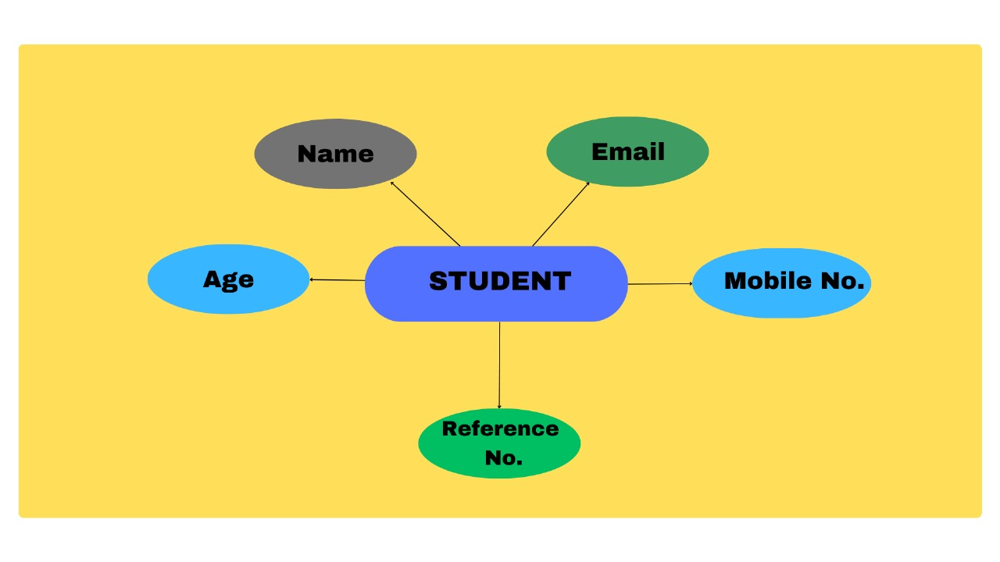
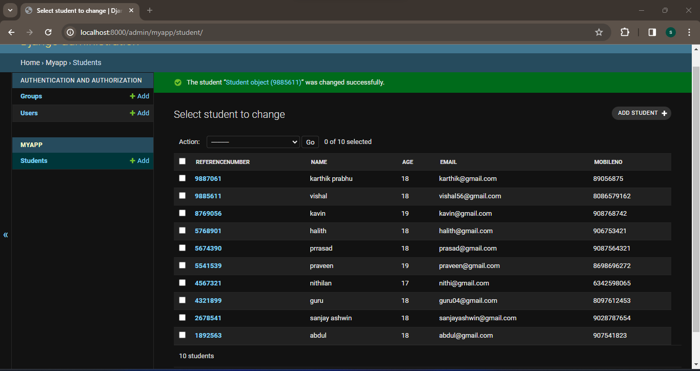

# Django ORM Web Application

## AIM
To develop a Django application to store and retrieve data from a database using Object Relational Mapping(ORM).

## Entity Relationship Diagram

Include your ER diagram here

## DESIGN STEPS

### STEP 1: 

Clone the empty Repository from Github.

### STEP 2:

Under the directory Dataproject install a Django project named 'myapp'. Check database engine 'sqlite'.

### STEP 3:

Write our code in models.py and modify settings.py and admin.py.Run Django project.

## PROGRAM

### models.py

from django.db import models
from django.contrib import admin

#### Create your models here.
class Student (models.Model):
    referencenumber=models.CharField(primary_key=True,max_length=20,help_text="reference number")
    name=models.CharField(max_length=100)
    age=models.IntegerField()
    email=models.EmailField()
    mobileno=models.IntegerField()

class StudentAdmin(admin.ModelAdmin):
    list_display=('referencenumber','name','age','email','mobileno')

### admin.py

from django.contrib import admin
from .models import Student,StudentAdmin

#### Register your models here.
admin.site.register(Student,StudentAdmin)

## OUTPUT

## RESULT
The program is executed successfully
